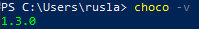

 
+ Створили обліковий запис GitHub:  
  

+ Встановили CHOCOLATEY за допомогою наступного коду:  
```
Set-ExecutionPolicy Bypass -Scope Process -Force; [System.Net.ServicePointManager]::SecurityProtocol = [System.Net.ServicePointManager]::SecurityProtocol -bor 3072; iex ((New-Object System.Net.WebClient).DownloadString('https://chocolatey.org/install.ps1'))
```
+ Перевірили версію:  
  
+ Встановили Git за допомогою наступного коду та перевірили версію:  
```
choco install git -y
```
  
+ Виконали перші налаштування Git:  
```
git config --global user.name "RuslanSheiko"  
git config --global user.email r.o.sheiko@student.khai.edu  
```
+ Перевірили застосування налаштувань наступним кодом:  
```
git config --list
```
  
+ Згенерували новий SSH ключ та додали його до облікового запсу Github:  
```
ssh-keygen -t ed25519 -C "r.o.sheiko@student.khai.edu"
```
  
+ Створили новий репозиторій, назва відповідає нікнейму:  

  

+ Зробили копію репозиторію на локальний комп'ютер, використовуючи ssh-ключ та код:  
  
```
git clone git@github.com:RuslanSheiko/LR1.git
```

+ Додали опис профілю Github за допомогою наступних команд:  
```
git add .
git commit -m "Add your comment"
git push
```
<<<<<<< HEAD
+ Отримали наступний результат


+ Висновок

У лабораторній роботі навчилися працювати з git та GitHub. Було створено новий профіль в GitHub та оформлено. Встановили CHOCOLATEY та git з його допомогою. Під'єднали git та GitHub, вивантажи локальний репозиторій з основною інформацією про власника.


=======
+ Отримали наступний результат  
  

>>>>>>> 67e87902a7bfcfbd7f0aa084b639c8ba043ba961
